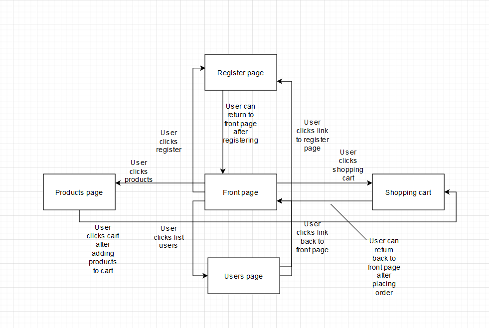

# Welcome to your group's Web Development 1 group work repository

# Group 

Member1:  Rauli Virtanen, rauli.virtanen@tuni.fi, 290592, 
responsible for: Database schemas, Full stack development

Member2:  Onni Hartikainen, onni.hartikainen@tuni.fi, 290570, 
responsible for: Readme, Full stack development

Member2:  Viljami Irri, viljami.irri@tuni.fi, student ID, 
responsible for: JSDoc, Full stack development

# Node project structure
### index.js
Starts the server.

### models/
Contains database schemas for users, products and orders.

### setup/
Contains files for initializing the database.

### routes.js
Contains handlers for all kinds of requests.

### utils/
Contains utilities for requests and responses.

### auth/
Contains means to authenticate a user.

### public/
Contains the html files that are shown in a browser.

### public/js
Contains .js files that are responsible for changes in the .html documents.

### test/
Contains unit test files for various actions in the webshop.

# Pages and navigation

Here is a diagram representing website

# Data models

### Product model
Attributes:
* Name, type: String
* Price, type: Number
* Image, type: String
* Description, type: String

Description: The product model represents a product in the web shop

Connections to other models: Orders contain products.

### Order model
Attributes:
* CustomerId, type: String
* Items, type: Array
* Image, type: String
* Description, type: String

Description: The order model represents a single order in the webshop

Connections to other models: Orders contain products.

### User model
Attributes:
* Name, type: String
* Email, type: String
* Password, type: String
* Role, type: String

Description: The user model represents a single user.

# Security concerns

### Authentication 
WebShop uses basic authentication. Hash from password given in registration is made with brycpt.hashSync. 10 saltrounds is used and 64 bit –encryption. This is not considered to be recommended encryption method, but in this practice we evaluated it to be enough. Minimum length of password is 10 and that is very decent amount of required characters. 
Inputfields for registering user and updating it are being validated for e-mail.  
 
### Traffic encryption 
Requests and responses are unencrypted. If the shop was online, would it be important to SSL –encrypt incoming and outgoing traffic. This would require the use of the certificicates, but that was outside the scope of the practice. Application being a webshop, it is logical that there is money transfer involved. This and personal user data emphasis the need of encryption. Also Bank –API:s would probably require that anyway in addition of using time sensitive tokens and cookies. 
Same-site cookies could be used to prevent CRSF –attacks. 
 
### GDPR 
Apllication collects, processes and saves data from users to register.  GDPR will apply. At least clients name and email will be collected. User should be informed of that and other information required by GDPR should be provided in privacy policy statement about register collectors and keepers oblications and register subjects rights. 

# Testing

Course -provided tests used. Since course -test were were quite comprehensive and the time was of an essence, we didn't write extra tests. Project grade from 4->5 ie. Round 11, turned out to be very time consuming and challenging (compared to grades 0-4) even without additional tests. 

# How to run:
1. Navigate to projects root 
2. Install dependencies using `npm install`
3. Start backend with command `node index.js`
4. Website is now available in localhost port 3000.

